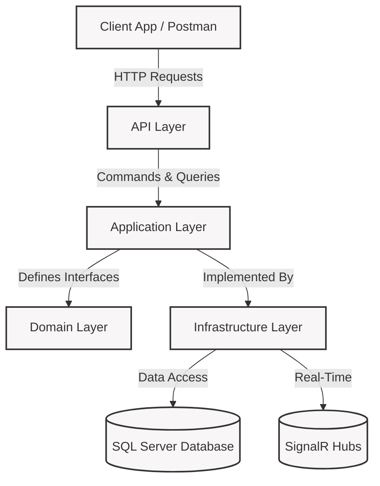
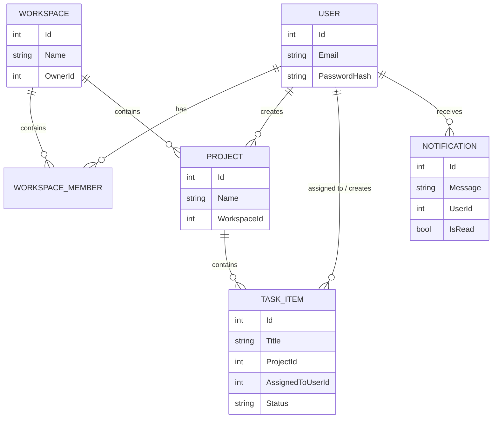
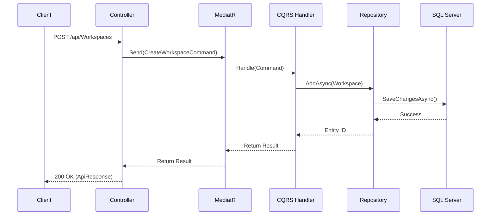

# DevFlow

DevFlow is a backend platform for team collaboration and project management built with ASP.NET Core.

The project follows Clean Architecture and CQRS principles and is designed to evolve into a scalable foundation for workspace management, project tracking, workflow automation, notifications, and analytics.

> ⚠️ Project Status: Active Development  
> Authentication, Workspace Management, Project Management, Task Tracking, and Real-Time Notifications are completed. Additional advanced modules are planned and will be added incrementally.

---

# Vision

DevFlow aims to become a modern collaboration platform inspired by tools such as Jira, Trello, and similar project management systems.

The long-term goal is to provide:

- Workspace Management
- Project Management
- Task Tracking
- Team Collaboration
- Real-Time Notifications
- Workflow Automation
- Analytics & Reporting

---

# Features

## Authentication
- User Registration
- User Login
- JWT Authentication
- Refresh Token Support
- Secure Logout
- Password Hashing

## Workspace Management
- Create Workspace
- Get Workspace By Id
- Get My Workspaces
- Get Workspace Members
- Add Workspace Members
- Remove Workspace Members
- Workspace Role Management

## Project & Task Management
- Create, Update, Delete Projects
- Assign Tasks to Workspace Members
- Task Status & Priority Tracking
- Track Task Due Dates

## Notifications (Real-Time)
- In-App Notifications
- Real-time updates via SignalR (`NotificationHub`)
- Domain Events (Task Assigned, Task Completed, Project Created)

## Security
- JWT Protected Endpoints
- Role-Based Authorization
- Owner/Admin Permission Enforcement
- Workspace Membership Validation
- Global Exception Handling

## Application Infrastructure
- CQRS with MediatR
- FluentValidation
- Validation Pipeline Behavior
- Logging Pipeline Behavior
- Domain Events Dispatcher
- Dependency Injection

---

# Architecture

DevFlow follows Clean Architecture to maintain separation of concerns and support future growth.

## Project Structure

```text
DevFlow (API)
│
├── Controllers
├── Middleware
├── Program.cs
│
DevFlow.Application
│
├── Commands
├── Queries
├── Validators
├── Behaviors
├── Interfaces
├── DomainEvents
│
DevFlow.Domain
│
├── Entities (User, Workspace, Project, TaskItem, Notification)
├── Enums
├── Events
│
DevFlow.Infrastructure
│
├── Persistence (DevFlowDbContext)
├── Repositories
├── Security
├── Hubs (SignalR)
```

## High-Level Architecture



## Entity Relationship Diagram



## CQRS Workflow Example



## Architectural Patterns
- Clean Architecture
- CQRS (Command Query Responsibility Segregation)
- Repository Pattern
- Unit of Work
- Domain-Driven Design (Domain Events)
- MediatR
- Dependency Injection
- Global Exception Handling

---

# Technology Stack

## Backend
- ASP.NET Core
- C#
- Entity Framework Core
- SQL Server

## Libraries
- MediatR
- FluentValidation
- JWT Bearer Authentication
- SignalR (Real-Time Web Sockets)

---

# Current Progress

| Module | Status |
|----------|----------|
| Authentication | ✅ Completed |
| Refresh Tokens | ✅ Completed |
| Workspace Management | ✅ Completed |
| Role-Based Authorization | ✅ Completed |
| CQRS Setup | ✅ Completed |
| Domain Events & Dispatcher | ✅ Completed |
| Validation Pipeline | ✅ Completed |
| Logging Pipeline | ✅ Completed |
| Project Management | ✅ Completed |
| Task Management | ✅ Completed |
| Notifications | ✅ Completed |
| Real-Time Updates (SignalR) | ✅ Completed |
| Workflow Automation | 🚧 Planned |
| Analytics & Reporting | 🚧 Planned |

---

# Implemented Domain Model

## User
- Authentication & Refresh Tokens
- Workspace Memberships

## Workspace
- Owner & Members
- Role Management (Owner, Admin, Member)

## Project
- Belongs to a Workspace
- Contains Tasks
- Fires Domain Events (`ProjectCreatedEvent`)

## TaskItem
- Belongs to a Project
- Assignable to Users
- Tracks Status (`Todo`, `InProgress`, `Review`, `Completed`)
- Tracks Priority (`Low`, `Medium`, `High`)
- Fires Domain Events (`TaskAssignedEvent`, `TaskCompletedEvent`)

## Notification
- User-specific notifications
- Read/Unread tracking
- Delivered via SignalR

---

# Getting Started

## Prerequisites
- .NET SDK
- SQL Server

## Clone Repository

```bash
git clone https://github.com/MuhammadBilal64/DevFlow.git
cd DevFlow
```

## Configure Database

Update the connection string in:

```text
DevFlow/appsettings.json
```

## Apply Migrations

```bash
dotnet ef database update --project DevFlow.Infrastructure --startup-project DevFlow
```

## Run Application

```bash
cd DevFlow
dotnet run
```

The API will be available locally after startup.

---

# Roadmap

## Phase 1 (Completed)
- Authentication
- JWT & Refresh Tokens
- Workspace Management
- Role-Based Authorization

## Phase 2 (Completed)
- Project Management
- Task Management
- Domain Events (Task Assignments, etc.)

## Phase 3 (Completed)
- Real-Time Updates via SignalR
- In-App Notifications System

## Phase 4 (Next)
- Comments on Tasks
- Activity Tracking Logs
- Advanced Workflow Automation
- Analytics & Reporting

---

# Learning Objectives

DevFlow is also a practical learning project focused on applying modern backend engineering concepts:

- Clean Architecture
- CQRS & MediatR
- Entity Framework Core
- Domain-Driven Design (Domain Events)
- Authentication & Authorization
- Real-Time Communication (SignalR)
- Scalable Backend Development

---

# Contributing

DevFlow is actively under development.

Suggestions, discussions, issue reports, and future contributions are welcome.

For major changes, please open an issue first to discuss the proposed improvement.

---

# License

This project is licensed under the MIT License.
