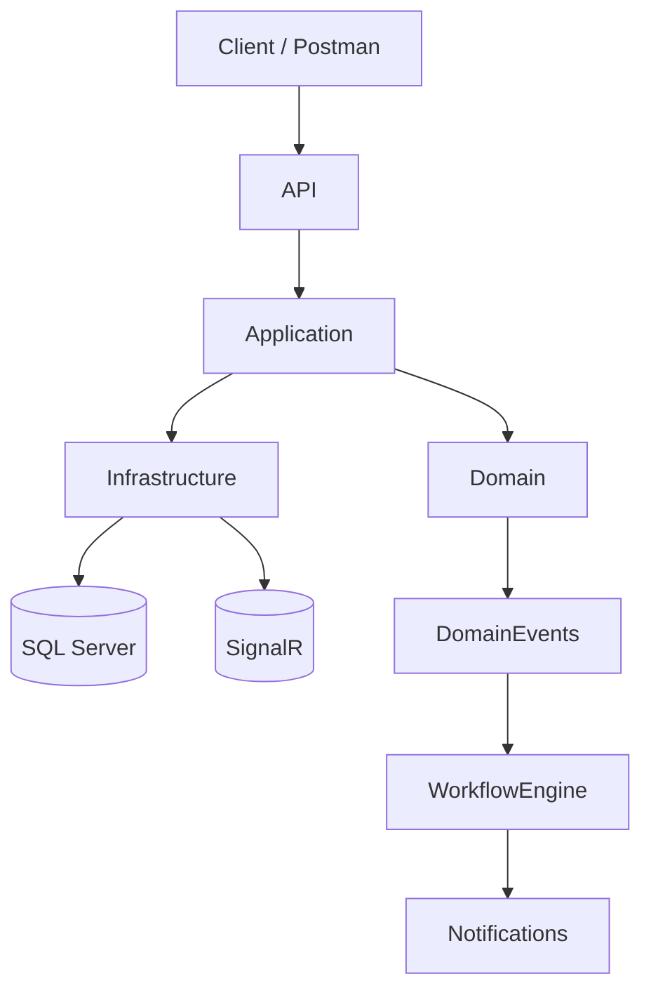
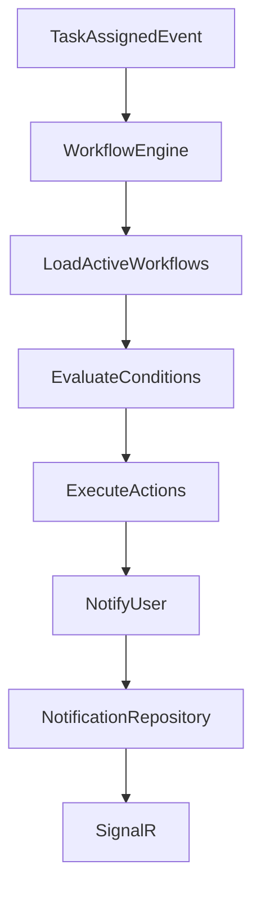
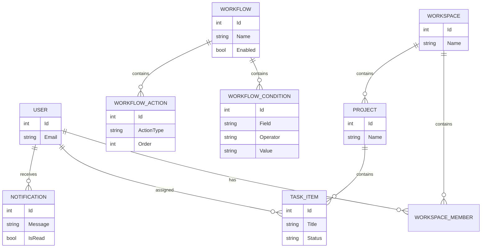
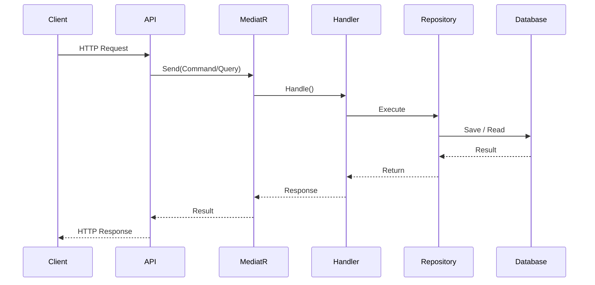

# DevFlow

DevFlow is a backend platform for team collaboration and project management built with ASP.NET Core.

The project follows **Clean Architecture**, **CQRS**, and **Domain-Driven Design (DDD)** principles to provide a scalable and maintainable foundation for workspace management, project tracking, workflow automation, notifications, and future analytics.

The architecture emphasizes separation of concerns, extensibility, and maintainability while serving as a practical learning project for modern backend engineering.

> ⚠️ **Project Status: Active Development**
>
> Authentication, Workspace Management, Project Management, Task Management, Real-Time Notifications, and the Workflow Automation Engine are fully implemented.
>
> The current development focus is expanding automated test coverage (Unit, Integration, and End-to-End testing), followed by Analytics & Reporting and additional collaboration features.

---

# Vision

DevFlow aims to become a modern collaboration platform inspired by tools such as Jira, Trello, and similar project management systems.

The long-term goal is to provide:

## Completed

- ✅ Authentication & Authorization
- ✅ Workspace Management
- ✅ Project Management
- ✅ Task Management
- ✅ Real-Time Notifications
- ✅ Workflow Automation

## Planned

- 🚧 Team Collaboration
- 🚧 Analytics & Reporting
- 🚧 Activity Tracking
- 🚧 Additional Workflow Triggers & Actions

---

# Features

## Authentication

- User Registration
- User Login
- JWT Authentication
- Refresh Token Support
- Secure Logout
- Password Hashing
- Role-Based Authorization

---

## Workspace Management

- Create Workspace
- Update Workspace
- Delete Workspace
- Get Workspace By Id
- Get My Workspaces
- Workspace Membership Management
- Add Workspace Members
- Remove Workspace Members
- Workspace Role Management
- Owner/Admin Permission Enforcement

---

## Project & Task Management

### Projects

- Create Project
- Update Project
- Delete Project
- Workspace-based Project Organization

### Tasks

- Create Task
- Update Task
- Delete Task
- Assign Tasks to Workspace Members
- Task Status Tracking
- Task Priority Tracking
- Due Date Management
- Task Assignment Events

---

## Workflow Automation

The Workflow Automation module enables configurable business automation through workflows that respond to domain events.

Features include:

- Workflow CRUD APIs
- Enable / Disable Workflows
- Configurable Workflow Triggers
- Configurable Conditions
- Ordered Workflow Actions
- Strategy-based Condition Evaluation
- Strategy-based Action Execution
- Automatic Workflow Execution
- Workflow Notifications
- Domain Event Integration

### Current Supported Trigger

- TaskAssignedEvent

### Current Supported Action

- NotifyUser

The workflow engine is intentionally designed to be extensible, allowing new triggers, operators, and action executors to be added without modifying the core engine.

---

## Notifications

- In-App Notifications
- Real-Time Notifications via SignalR
- Business Notifications
- Workflow Notifications
- Read / Unread Tracking
- Automatic Notification Delivery

---

## Security

- JWT Protected Endpoints
- Role-Based Authorization
- Workspace Membership Validation
- Owner/Admin Permission Enforcement
- Global Exception Handling

---

## Application Infrastructure

- Clean Architecture
- CQRS with MediatR
- Repository Pattern
- Unit of Work
- Domain Events
- Dependency Injection
- FluentValidation
- Validation Pipeline Behavior
- Logging Pipeline Behavior

---

# Architecture

DevFlow follows Clean Architecture to keep business logic independent from infrastructure concerns while maintaining a scalable and testable architecture.

## Project Structure

```text
DevFlow (API)

├── Controllers
├── Middleware
├── Program.cs

DevFlow.Application

├── Authentication
├── Projects
├── Tasks
├── Workspaces
├── Workflows
├── Notifications
├── Behaviors
├── Common
├── Interfaces
├── DomainEvents

DevFlow.Domain

├── Entities
├── Enums
├── Events
├── ValueObjects

DevFlow.Infrastructure

├── Persistence
├── Repositories
├── Authentication
├── Security
├── Services
├── Hubs
```

---

## High-Level Architecture



---

## Workflow Execution Architecture



---

## Entity Relationship Diagram



---

## CQRS Request Flow



---

## Architectural Patterns

- Clean Architecture
- CQRS
- Repository Pattern
- Unit of Work
- Domain-Driven Design (DDD)
- Domain Events
- Strategy Pattern
- MediatR
- Dependency Injection
- Pipeline Behaviors
- Global Exception Handling
---

# Technology Stack

## Backend

- ASP.NET Core
- C#
- Entity Framework Core
- SQL Server

## Libraries & Frameworks

- ASP.NET Core Identity
- JWT Bearer Authentication
- MediatR
- FluentValidation
- SignalR

## Architectural Concepts

- Clean Architecture
- CQRS
- Domain-Driven Design (DDD)
- Repository Pattern
- Unit of Work
- Strategy Pattern
- Domain Events
- Dependency Injection

---

# Current Progress

| Module | Status |
|---------|--------|
| Authentication | ✅ Completed |
| JWT Authentication | ✅ Completed |
| Refresh Tokens | ✅ Completed |
| Workspace Management | ✅ Completed |
| Workspace Member Management | ✅ Completed |
| Role-Based Authorization | ✅ Completed |
| Project Management | ✅ Completed |
| Task Management | ✅ Completed |
| Notifications | ✅ Completed |
| Real-Time Notifications (SignalR) | ✅ Completed |
| Domain Events | ✅ Completed |
| CQRS | ✅ Completed |
| Validation Pipeline | ✅ Completed |
| Logging Pipeline | ✅ Completed |
| Workflow Automation | ✅ Completed |
| Workflow Management APIs | ✅ Completed |
| Workflow Engine | ✅ Completed |
| Workflow Notifications | ✅ Completed |
| Unit Testing | 🚧 Planned |
| Integration Testing | 🚧 Planned |
| End-to-End Testing | 🚧 Planned |
| Analytics & Reporting | 🚧 Planned |

---

# Workflow Automation Overview

The Workflow Automation module enables administrators to configure automated business workflows that react to domain events.

A workflow consists of:

- Trigger
- One or more Conditions
- One or more ordered Actions

When a supported domain event occurs, the workflow engine:

1. Loads all active workflows for the trigger.
2. Evaluates every configured condition.
3. Executes actions in order.
4. Persists workflow notifications.
5. Delivers notifications in real time using SignalR.

Current implementation includes:

### Supported Trigger

- TaskAssignedEvent

### Supported Condition Operators

- Equals
- NotEquals
- GreaterThan
- GreaterThanOrEqual
- LessThan
- LessThanOrEqual
- Contains

### Supported Action

- NotifyUser

The engine is fully extensible, allowing additional triggers, condition operators, and action executors to be introduced without modifying the core workflow engine.

---

# Workflow Management API

The Workflow module exposes authenticated REST endpoints for workflow management.

| Method | Endpoint |
|----------|----------|
| POST | `/api/workflows` |
| GET | `/api/workflows` |
| GET | `/api/workflows/{id}` |
| PUT | `/api/workflows/{id}` |
| PATCH | `/api/workflows/{id}/enable` |
| PATCH | `/api/workflows/{id}/disable` |

Supports:

- Pagination
- Searching
- Filtering
- Sorting
- Enable / Disable workflows

---

# Implemented Domain Model

## User

- Authentication
- Refresh Tokens
- Workspace Memberships
- Notifications

---

## Workspace

- Owner
- Members
- Role Management
- Contains Projects

---

## Project

- Belongs to a Workspace
- Contains Tasks
- Raises Domain Events

Current Event:

- ProjectCreatedEvent

---

## TaskItem

- Belongs to a Project
- Assigned to Workspace Members
- Status Tracking
- Priority Tracking
- Due Dates

Current Events:

- TaskAssignedEvent
- TaskCompletedEvent

---

## Notification

- User-specific Notifications
- Read / Unread Tracking
- SignalR Delivery
- Workflow Notifications

---

## Workflow

Represents an automation rule.

Contains:

- Trigger
- Conditions
- Actions
- Enabled State

---

## WorkflowCondition

Represents a configurable rule evaluated during workflow execution.

Contains:

- Target Field
- Comparison Operator
- Comparison Value

---

## WorkflowAction

Represents an action executed after successful condition evaluation.

Current implementation supports:

- NotifyUser

The design supports adding future actions without changing the workflow engine.

---

# End-to-End Workflow Verification

The Workflow Automation module has been verified through an end-to-end execution flow.

Verified scenario:

1. Create Workflow
2. Enable Workflow
3. Create Workspace
4. Add Workspace Member
5. Create Project
6. Create Task
7. Assign Task
8. TaskAssignedEvent Published
9. Workflow Engine Executed
10. Conditions Evaluated
11. NotifyUser Action Executed
12. Notification Persisted
13. SignalR Notification Delivered

The workflow engine executes automatically as part of the application's normal request pipeline without requiring controller-level integration.

---

# Getting Started

## Prerequisites

- .NET SDK
- SQL Server

---

## Clone Repository

```bash
git clone https://github.com/MuhammadBilal64/DevFlow.git
cd DevFlow
```

---

## Configure Database

Update the connection string in:

```text
DevFlow/appsettings.json
```

---

## Apply Migrations

```bash
dotnet ef database update --project DevFlow.Infrastructure --startup-project DevFlow
```

---

## Run the Application

```bash
cd DevFlow
dotnet run
```

The API will be available locally after startup.

Authentication is required for protected endpoints.

---

# Roadmap

The project is being developed incrementally, with each phase focusing on a major backend capability.

## Phase 1 — Authentication & Workspace Management ✅

Completed

- JWT Authentication
- Refresh Token Support
- ASP.NET Core Identity
- Workspace Management
- Workspace Membership Management
- Role-Based Authorization
- Owner/Admin Permission Enforcement

---

## Phase 2 — Project & Task Management ✅

Completed

- Project Management
- Task Management
- Task Assignment
- Task Status Tracking
- Task Priority Tracking
- Due Date Management
- Domain Events

---

## Phase 3 — Notifications ✅

Completed

- In-App Notifications
- Real-Time Notifications (SignalR)
- Notification APIs
- Notification Persistence
- Business Notifications

---

## Phase 4 — Workflow Automation ✅

Completed

The Workflow Automation module introduces configurable business automation through workflows.

Completed features include:

- Workflow Domain Model
- Workflow CRUD APIs
- Enable / Disable Workflows
- Workflow Repository
- Workflow Engine
- Strategy-based Condition Evaluation
- Strategy-based Action Execution
- NotifyUser Action
- Workflow Notifications
- Domain Event Integration
- End-to-End Workflow Execution

Current supported trigger:

- TaskAssignedEvent

Current supported action:

- NotifyUser

The architecture is intentionally extensible to support future triggers, operators, and action executors.

---

## Phase 5 — Testing 🚧

Current Focus

The next milestone is building a comprehensive testing suite for the application.

Planned:

- Unit Testing
- Integration Testing
- End-to-End Testing
- API Testing
- Domain Testing
- Handler Testing
- Repository Testing
- Workflow Engine Testing
- Authentication Testing

---

## Phase 6 — Analytics & Reporting

Planned

- Dashboard Statistics
- Project Analytics
- Workspace Analytics
- User Productivity Metrics
- Reporting APIs
- Aggregated Queries

---

## Future Enhancements

Planned improvements include:

- Comments on Tasks
- Activity Timeline
- Audit Logs
- File Attachments
- Email Notifications
- Additional Workflow Triggers
- Additional Workflow Actions
- Scheduled Workflows
- Background Jobs
- Performance Optimizations
- Redis Caching
- Docker Support
- CI/CD Pipeline
- Cloud Deployment
- Message Queue Integration
- Monitoring & Observability

---

# Learning Objectives

DevFlow is more than a CRUD application.

It is a practical learning project focused on applying modern backend engineering concepts used in production systems.

Topics covered include:

- Clean Architecture
- CQRS with MediatR
- Domain-Driven Design (DDD)
- Entity Framework Core
- Repository Pattern
- Unit of Work
- Domain Events
- Strategy Pattern
- Dependency Injection
- FluentValidation
- Pipeline Behaviors
- JWT Authentication
- Refresh Tokens
- Role-Based Authorization
- SignalR
- Workflow Engine Design
- Event-Driven Architecture
- Scalable Backend Development

Upcoming learning topics:

- Unit Testing
- Integration Testing
- End-to-End Testing
- Redis
- Docker
- CI/CD
- Background Processing
- Distributed Systems Concepts

---

# Project Highlights

Some of the key architectural features implemented in DevFlow include:

- Clean Architecture
- CQRS using MediatR
- Repository Pattern
- Unit of Work
- Domain Events
- Event-Driven Workflow Automation
- Strategy-based Condition Evaluation
- Strategy-based Action Execution
- Real-Time Notifications with SignalR
- Global Exception Handling
- Validation & Logging Pipeline Behaviors
- Extensible Workflow Engine

---

# Future Vision

The long-term goal of DevFlow is to evolve into a production-style collaboration platform capable of supporting:

- Large Workspaces
- Team Collaboration
- Workflow Automation
- Advanced Analytics
- Background Processing
- Scalable Infrastructure
- Cloud Deployment
- Enterprise-Level Backend Architecture

The project is intentionally designed so that new modules can be added without requiring major architectural changes.

---

# Contributing

DevFlow is currently under active development.

Suggestions, discussions, issue reports, and pull requests are welcome.

If you would like to contribute:

1. Fork the repository.
2. Create a feature branch.
3. Commit your changes.
4. Open a Pull Request.

For significant changes, please open an issue first to discuss the proposed design.

---

# License

This project is licensed under the MIT License.

---

# Author

**Muhammad Bilal**

Backend Developer | ASP.NET Core | Clean Architecture | CQRS | Domain-Driven Design

DevFlow is an ongoing learning project built to explore modern backend engineering practices while applying production-inspired architectural patterns.
