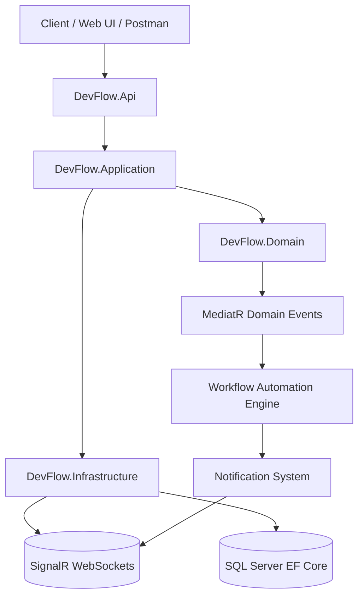
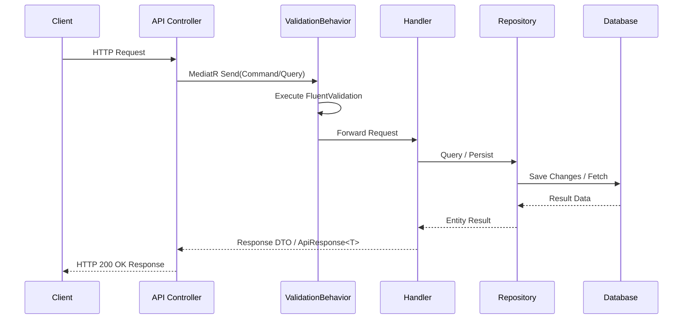
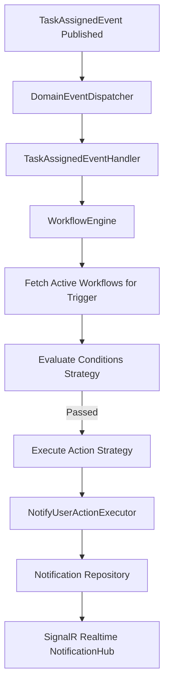
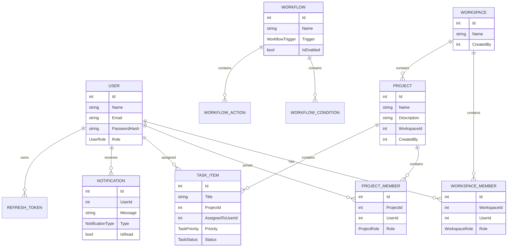

# DevFlow

DevFlow is an enterprise-grade backend platform for team collaboration, project tracking, and workflow automation built with ASP.NET Core (.NET 9).

The project follows **Clean Architecture**, **CQRS (Command Query Responsibility Segregation)**, and **Domain-Driven Design (DDD)** principles to provide a robust, scalable, and maintainable foundation for workspace organization, project management, real-time notifications, and extensible business automation.

> ⚠️ **Project Status: Active Development**
>
> Authentication, Workspace Management, Project Management, Project Membership, Task Management, Real-Time Notifications (SignalR), the Workflow Automation Engine, and a **Comprehensive Unit Testing Suite (348 Passing Tests)** are fully implemented.
>
> The current development focus is Integration Testing and Analytics & Reporting, followed by expanded collaboration features.

---

# Vision

DevFlow aims to become a modern, high-performance project management & team collaboration platform inspired by industry tools such as Jira, Trello, and Linear.

## Completed

- ✅ Authentication & Authorization (JWT + Refresh Tokens)
- ✅ Workspace Management (Roles, Membership, Granular Authorizations)
- ✅ Project Management & Project Membership Management
- ✅ Task Management (Kanban States, Priority, Assignment Events)
- ✅ Real-Time Notifications (SignalR WebSockets)
- ✅ Workflow Automation Engine (Strategy-based Triggers, Conditions, Actions)
- ✅ Comprehensive Unit Test Suite (**348/348 Unit Tests Passed**)

## Planned

- 🚧 Integration & End-to-End Testing
- 🚧 Analytics & Reporting Dashboard
- 🚧 Activity Tracking & Audit Logs
- 🚧 Additional Workflow Triggers & Actions (e.g., TaskCompleted, Webhooks)

---

# Features

## Authentication & Security

- User Registration & Authentication
- JWT Bearer Access Tokens
- Refresh Token Support (Sliding Expiration & Revocation)
- Password Hashing (BCrypt / ASP.NET Identity)
- Role-Based Authorization (`Admin`, `Manager`, `Member`)
- Global Exception Handling Middleware

---

## Workspace Management

- Create, Update, Delete Workspace
- Workspace Membership Management (Add/Remove members by email)
- Workspace Role Management (`Owner`, `Admin`, `Member`)
- Owner & Admin Authorization Enforcement
- Paginated Workspace Queries (`GetMyWorkspaces`, `GetWorkspaceMembers`)

---

## Project & Task Management

### Projects & Project Members

- Create, Update, Delete Projects (Workspace-scoped)
- Project Membership Management (`AddProjectMember`, `GetProjectMembers`, `RemoveProjectMember`)
- Granular Project Authorization Checks (`IProjectAuthorizationService`)

### Tasks

- Create, Update, Delete Tasks
- Priority Tracking (`Low`, `Medium`, `High`)
- Status Lifecycle (`Todo`, `InProgress`, `Completed`)
- Assign Tasks to Workspace/Project Members
- Due Date Tracking
- Domain Event Triggers (`TaskAssignedEvent`, `TaskCompletedEvent`)
- Paginated & Filtered Queries (Filter by Status, Priority, Assignee)

---

## Workflow Automation Engine

The Workflow Automation module enables configurable, event-driven business automation without modifying application core logic.

Features include:

- Configurable Workflow Triggers (`TaskAssignedEvent`, `TaskCompletedEvent`, `ProjectCreatedEvent`)
- Strategy-Based Condition Evaluation (`Equals`, `NotEquals`, `GreaterThan`, `GreaterThanOrEqual`, `LessThan`, `LessThanOrEqual`, `Contains`)
- Strategy-Based Action Dispatching & Execution (`NotifyUser`)
- Automatic MediatR Domain Event Interception & Workflow Dispatching
- Workflow CRUD & Management APIs (Enable/Disable Workflows)

---

## Real-Time Notifications

- In-App Notification Persistence
- WebSockets via SignalR (`/notificationHub`)
- Real-Time Broadcasts for Task Assignments & Workflow Triggers
- Notification State Tracking (`IsRead`, Unread Counter, Mark All Read)

---

## Architecture & Code Quality

- Clean Architecture with strict layer isolation
- CQRS powered by MediatR
- Repository Pattern & Unit of Work (`IUnitOfWork`)
- Domain-Driven Design (Domain Entities, Value Objects, Domain Events)
- FluentValidation Pipeline Behavior
- Logging Pipeline Behavior
- **348 Unit Tests** verifying Domain Logic, Handlers, Validators, Event Handlers, and Strategy Executors

---

# Architecture

DevFlow strictly isolates domain rules from infrastructure, database, and UI concerns through Clean Architecture layer separation.

## Project Structure

```text
DevFlow (Solution)
│
├── DevFlow (Api Project)
│   ├── Controllers/               # REST Endpoints (Auth, Workspace, Project, Task, Workflow, Notification)
│   ├── Middleware/                # GlobalExceptionHandlingMiddleware
│   ├── Program.cs                 # Composition Root & Middleware Pipeline
│   └── appsettings.json
│
├── DevFlow.Application            # Application Layer (CQRS Commands & Queries)
│   ├── Abstractions/              # Repository & Service Interfaces
│   ├── Common/                    # Behaviors (Validation, Logging), Models (ApiResponse, PagedResult)
│   ├── DomainEvents/              # Domain Event Handlers (TaskAssigned, TaskCompleted, ProjectCreated)
│   ├── Exceptions/                # Typed Domain/Application Exceptions
│   ├── Notifications/             # Notification CQRS Handlers
│   ├── ProjectMembers/            # Project Membership CQRS Handlers
│   ├── Projects/                  # Project CQRS Handlers
│   ├── Tasks/                     # Task CQRS Handlers
│   ├── Users/                     # Auth & User CQRS Handlers
│   ├── WorkflowAutomation/        # Workflow Engine, Condition Evaluators & Action Executors
│   ├── Workflows/                 # Workflow CRUD CQRS Handlers
│   └── Workspaces/                # Workspace CQRS Handlers
│
├── DevFlow.Domain                 # Core Domain Layer (Zero External Dependencies)
│   ├── Entities/                  # User, Workspace, WorkspaceMember, Project, ProjectMember, TaskItem, Notification, Workflow, RefreshToken
│   ├── Enum/                      # UserRole, WorkspaceRole, ProjectRole, TaskPriority, TaskStatus, NotificationType, WorkflowTrigger, etc.
│   └── Events/                    # IDomainEvent, TaskAssignedEvent, TaskCompletedEvent, ProjectCreatedEvent
│
├── DevFlow.Infrastructure         # Infrastructure & Persistence Layer
│   ├── Persistence/               # DevFlowDbContext & EF Core Entity Configurations
│   ├── Repositories/              # EF Core Repository Implementations & UnitOfWork
│   ├── Security/                  # JwtTokenGenerator, PasswordHasher
│   ├── Services/                  # WorkspaceAuthorizationService, ProjectAuthorizationService, DomainEventDispatcher
│   └── Hubs/                      # SignalR NotificationHub
│
└── DevFlow.UnitTests              # Comprehensive Unit Test Suite (348 Unit Tests)
    ├── Application/               # Handler, Validator & Strategy Tests
    ├── Common/                    # Pipeline Behavior Tests
    └── Domain/                    # Domain Entity & Event Tests
```

---

## High-Level Architecture


```mermaid
graph TD

Client[Client / Web UI / Postman]

Client --> API[DevFlow.Api]

API --> Application[DevFlow.Application]

Application --> Domain[DevFlow.Domain]

Application --> Infrastructure[DevFlow.Infrastructure]

Infrastructure --> SQL[(SQL Server EF Core)]

Infrastructure --> SignalR[(SignalR WebSockets)]

Domain --> DomainEvents[MediatR Domain Events]

DomainEvents --> WorkflowEngine[Workflow Automation Engine]

WorkflowEngine --> Notifications[Notification System]

Notifications --> SignalR
```

---

## CQRS Request Pipeline


```mermaid
sequenceDiagram

participant Client
participant API Controller
participant ValidationBehavior
participant Handler
participant Repository
participant Database

Client->>API Controller: HTTP Request
API Controller->>ValidationBehavior: MediatR Send(Command/Query)
ValidationBehavior->>ValidationBehavior: Execute FluentValidation
ValidationBehavior->>Handler: Forward Request
Handler->>Repository: Query / Persist
Repository->>Database: Save Changes / Fetch
Database-->>Repository: Result Data
Repository-->>Handler: Entity Result
Handler-->>API Controller: Response DTO / ApiResponse<T>
API Controller-->>Client: HTTP 200 OK Response
```

---

## Workflow Automation Execution Flow


```mermaid
graph TD

TaskAssigned[TaskAssignedEvent Published]

TaskAssigned --> DomainEventDispatcher

DomainEventDispatcher --> TaskAssignedEventHandler

TaskAssignedEventHandler --> WorkflowEngine

WorkflowEngine --> FetchWorkflows[Fetch Active Workflows for Trigger]

FetchWorkflows --> EvaluateConditions[Evaluate Conditions Strategy]

EvaluateConditions -- Passed --> ExecuteActions[Execute Action Strategy]

ExecuteActions --> NotifyUser[NotifyUserActionExecutor]

NotifyUser --> SaveNotification[Notification Repository]

SaveNotification --> RealtimeHub[SignalR Realtime NotificationHub]
```

---

## Entity Relationship Diagram (ERD)


```mermaid
erDiagram

USER ||--o{ WORKSPACE_MEMBER : has
WORKSPACE ||--o{ WORKSPACE_MEMBER : contains
WORKSPACE ||--o{ PROJECT : contains
PROJECT ||--o{ PROJECT_MEMBER : contains
USER ||--o{ PROJECT_MEMBER : joined
PROJECT ||--o{ TASK_ITEM : contains
USER ||--o{ TASK_ITEM : assigned
USER ||--o{ NOTIFICATION : receives
USER ||--o{ REFRESH_TOKEN : owns
WORKFLOW ||--o{ WORKFLOW_CONDITION : contains
WORKFLOW ||--o{ WORKFLOW_ACTION : contains

USER {
    int Id
    string Name
    string Email
    string PasswordHash
    UserRole Role
}

WORKSPACE {
    int Id
    string Name
    int CreatedBy
}

WORKSPACE_MEMBER {
    int Id
    int WorkspaceId
    int UserId
    WorkspaceRole Role
}

PROJECT {
    int Id
    string Name
    string Description
    int WorkspaceId
    int CreatedBy
}

PROJECT_MEMBER {
    int Id
    int ProjectId
    int UserId
    ProjectRole Role
}

TASK_ITEM {
    int Id
    string Title
    int ProjectId
    int AssignedToUserId
    TaskPriority Priority
    TaskStatus Status
}

NOTIFICATION {
    int Id
    int UserId
    string Message
    NotificationType Type
    bool IsRead
}

WORKFLOW {
    int Id
    string Name
    WorkflowTrigger Trigger
    bool IsEnabled
}
```

---

# Technology Stack

## Backend Framework & Core

- **Framework**: .NET 9 ASP.NET Core Web API
- **Language**: C# 13
- **ORM**: Entity Framework Core 9
- **Database**: SQL Server

## Libraries & Packages

- **MediatR**: CQRS pattern implementation & in-process messaging
- **FluentValidation**: Request model validation
- **BCrypt.Net**: Secure password hashing
- **Microsoft.AspNetCore.Authentication.JwtBearer**: JWT Security
- **Microsoft.AspNetCore.SignalR**: Real-time WebSocket notifications
- **xUnit, FluentAssertions, Moq**: Unit testing framework & mocking library

---

# Current Progress

| Module | Status | Details |
|---|---|---|
| Authentication & Identity | ✅ Completed | JWT, Refresh Tokens, BCrypt, Logout |
| Workspace Management | ✅ Completed | CRUD, Membership, Owner/Admin Authorization |
| Project Management | ✅ Completed | CRUD, Workspace Scope, Member Management |
| Task Management | ✅ Completed | CRUD, Status (Todo/InProgress/Completed), Priority, Assignee |
| Real-Time Notifications | ✅ Completed | Persistent Notifications, SignalR WebSockets |
| Workflow Automation | ✅ Completed | Strategy-based Triggers, Conditions & Actions |
| Domain Events | ✅ Completed | TaskAssigned, TaskCompleted, ProjectCreated |
| Validation Pipeline | ✅ Completed | FluentValidation MediatR Pipeline Behavior |
| Unit Testing | ✅ Completed | **348 / 348 Unit Tests Passed (100% Pass Rate)** |
| Integration Testing | 🚧 Planned | WebApplicationFactory API Endpoint Testing |
| End-to-End Testing | 🚧 Planned | Full Integration Flows |
| Analytics & Reporting | 🚧 Planned | Dashboard Metrics & Aggregated Queries |

---

# Test Suite Verification

DevFlow contains a comprehensive unit test suite written with **xUnit**, **FluentAssertions**, and **Moq**.

### Running Tests

To run the unit test suite locally:

```bash
dotnet test DevFlow.UnitTests/DevFlow.UnitTests.csproj
```

### Test Summary

```text
Passed!  - Failed: 0, Passed: 348, Skipped: 0, Total: 348
```

The unit test suite covers:
- **Domain Entities & Logic**: Invariants on TaskItem, Workflow, Project, Workspace, User.
- **Application CQRS Handlers**: Command & Query Handlers across Auth, Workspaces, Projects, Project Members, Tasks, Workflows, Notifications.
- **FluentValidation Rules**: Validator behavior for all input DTOs and Commands.
- **MediatR Pipeline Behaviors**: `ValidationBehavior` validation enforcement.
- **Workflow Automation Engine**: Condition evaluators (Equals, NotEquals, GreaterThan, LessThan, Contains), Action Executors (NotifyUser), and `WorkflowEngine` orchestration.
- **Domain Event Handlers**: Event-to-Workflow & Event-to-Notification dispatching.

---

# Getting Started

## Prerequisites

- [.NET 9.0 SDK](https://dotnet.microsoft.com/download/dotnet/9.0)
- SQL Server (LocalDB or full instance)

---

## Quick Setup

1. **Clone Repository**:
   ```bash
   git clone https://github.com/MuhammadBilal64/DevFlow.git
   cd DevFlow
   ```

2. **Configure Connection String**:
   Update `appsettings.json` inside `DevFlow/DevFlow`:
   ```json
   "ConnectionStrings": {
     "DefaultConnection": "Server=(localdb)\\mssqllocaldb;Database=DevFlowDb;Trusted_Connection=True;MultipleActiveResultSets=true"
   }
   ```

3. **Apply Database Migrations**:
   ```bash
   dotnet ef database update --project DevFlow.Infrastructure --startup-project DevFlow/DevFlow
   ```

4. **Run Application**:
   ```bash
   cd DevFlow/DevFlow
   dotnet run
   ```

The API will start at `https://localhost:7001` / `http://localhost:5000`. Swagger documentation is available at `/swagger` in Development mode.

---

# Author

**Muhammad Bilal**
Backend Developer | ASP.NET Core | Clean Architecture | CQRS | DDD

DevFlow is built with production-grade backend engineering practices, focusing on maintainability, clean separation of concerns, test-driven development, and scalable event-driven automation.
