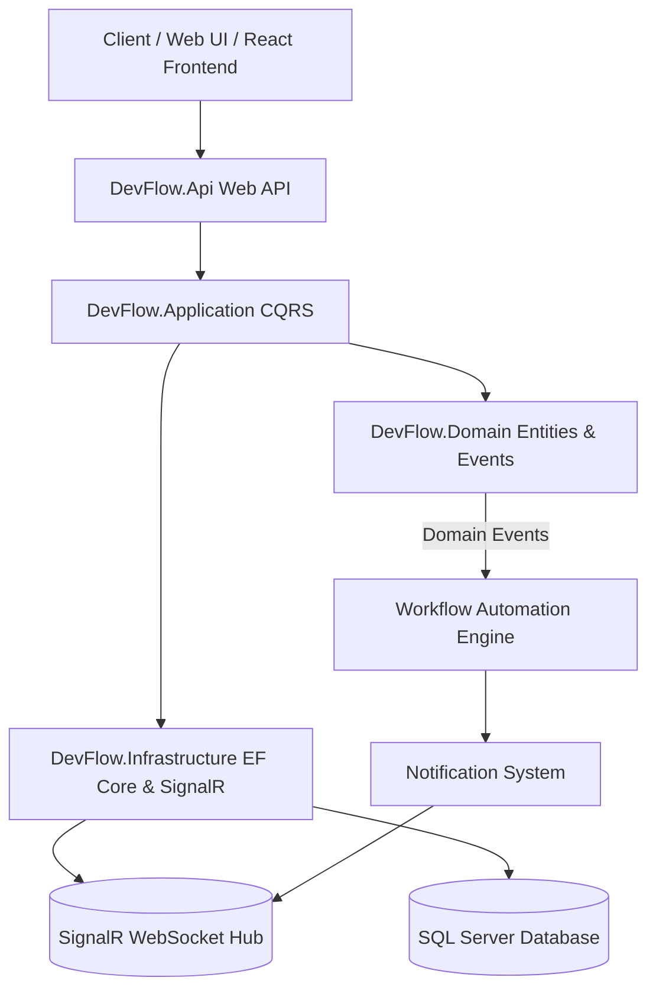
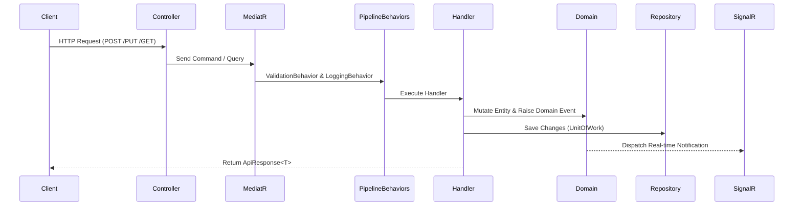

# ⚡ DevFlow Backend API

<p align="center">
  
</p>

<h3 align="center">Enterprise-Grade Developer Workflow Management & Collaboration Platform</h3>

<p align="center">
  An enterprise-grade, high-performance backend platform built with <strong>ASP.NET Core (.NET 9)</strong> adhering strictly to <strong>Clean Architecture</strong>, <strong>CQRS with MediatR</strong>, and <strong>Domain-Driven Design (DDD)</strong> principles.
</p>

<p align="center">
  <a href="#-architecture"><strong>Explore Architecture »</strong></a>
  ·
  <a href="#-features"><strong>Features Overview</strong></a>
  ·
  <a href="#-getting-started"><strong>Quick Start Guide</strong></a>
  ·
  <a href="details.md"><strong>API Reference (`details.md`)</strong></a>
</p>

<p align="center">
  
  
  
  
  
  
</p>

---

> ⚠️ **Project Status: Active Development**
>
> Authentication, Workspace Management, Project Management, Project Membership, Task Management, Real-Time Notifications (SignalR), the Workflow Automation Engine, and a **Comprehensive Unit Testing Suite (348 Passing Tests)** are fully implemented and verified.
>
> The current development focus is Integration Testing and Analytics & Reporting, followed by expanded collaboration features.

---

## 📋 Table of Contents

- [Overview & Vision](#-overview--vision)
- [Key Features](#-key-features)
  - [Authentication & Security](#authentication--security)
  - [Workspace Management](#workspace-management)
  - [Project & Task Management](#project--task-management)
  - [Workflow Automation Engine](#workflow-automation-engine)
  - [Real-Time Notifications](#real-time-notifications)
- [Architecture & Design Patterns](#-architecture--design-patterns)
  - [High-Level System Diagram](#high-level-system-diagram)
  - [CQRS Request Pipeline](#cqrs-request-pipeline)
  - [Solution Directory Structure](#solution-directory-structure)
- [Getting Started](#-getting-started)
  - [Prerequisites](#prerequisites)
  - [Configuration](#configuration)
  - [Database Setup & Migrations](#database-setup--migrations)
  - [Running the API](#running-the-api)
- [Running Unit Tests](#-running-unit-tests)
- [Frontend Integration Reference](#-frontend-integration-reference)
- [License](#-license)

---

## 🚀 Overview & Vision

**DevFlow** is designed as a modern, high-performance developer workflow and project management platform inspired by tools like Jira, Trello, and Linear. It provides software development teams with an extensible ecosystem to manage multi-tenant workspaces, Kanban task boards, domain event notifications, and automated business workflows.

### Project Roadmap Status

#### Completed ✅
- **Authentication & Security**: JWT Access Tokens, Refresh Token rotation & revocation, password hashing.
- **Workspace Management**: Multi-tenancy, owner/admin authorization enforcement, member invitations.
- **Project & Membership Management**: Workspace-scoped projects and role-based project access.
- **Task Management**: Kanban status lifecycle (`Todo`, `InProgress`, `Completed`), priority tracking, assignee updates, domain events.
- **Real-Time Notifications**: Persistent DB storage + SignalR WebSocket broadcasts (`/notificationHub`).
- **Workflow Engine**: Extensible Strategy Pattern engine intercepting MediatR domain events for rule evaluation and action execution.
- **Unit Testing Suite**: **348/348 Unit Tests Passed**.

#### Planned 🚧
- Integration & End-to-End Testing pipeline.
- Analytics & Reporting Dashboard endpoints.
- Activity Tracking & Audit Logs.
- Webhook Action Executors & External Integrations.

---

## ✨ Key Features

### Authentication & Security
- **User Registration & JWT Login**: Secure authentication issuing short-lived JWT tokens and long-lived refresh tokens.
- **Sliding Expiration**: Automated token refresh mechanism.
- **Role-Based Authorization**: Hierarchical roles (`Admin`, `Manager`, `Member`).
- **Middleware Pipeline**: Global exception handling middleware converting exceptions to standard JSON envelopes (`ApiResponse<T>`).

### Workspace Management
- Workspace creation, updating, and soft/hard deletion.
- Role management (`Owner`, `Admin`, `Member`).
- Paginated queries (`GetMyWorkspaces`, `GetWorkspaceMembers`) supporting search and sorting.

### Project & Task Management
- Workspace-scoped projects with project-level membership control (`AddProjectMember`, `RemoveProjectMember`).
- Task management with status lifecycle (`Todo`, `InProgress`, `Completed`) and priority levels (`Low`, `Medium`, `High`).
- Domain Event Triggers (`TaskAssignedEvent`, `TaskCompletedEvent`, `ProjectCreatedEvent`).

### Workflow Automation Engine
Configurable, event-driven business automation without altering core application code.
- **Triggers**: Domain event listeners (`TaskAssignedEvent`, `TaskCompletedEvent`, `ProjectCreatedEvent`).
- **Condition Evaluator**: Strategy-based operators (`Equals`, `NotEquals`, `GreaterThan`, `GreaterThanOrEqual`, `LessThan`, `LessThanOrEqual`, `Contains`).
- **Action Executors**: Strategy-based action dispatchers (`NotifyUser`).

### Real-Time Notifications
- In-App Notification persistence in SQL Server.
- SignalR WebSocket hub (`/notificationHub`) delivering real-time notification models to connected clients.
- Unread counter and bulk mark-as-read options.

---

## 🏗️ Architecture & Design Patterns

DevFlow strictly isolates domain rules from infrastructure, database, and UI concerns through **Clean Architecture** principles.

### High-Level System Diagram


```mermaid
graph TD
    Client[Client / Web UI / React Frontend]
    API[DevFlow.Api Web API]
    Application[DevFlow.Application CQRS]
    Domain[DevFlow.Domain Entities & Events]
    Infrastructure[DevFlow.Infrastructure EF Core & SignalR]
    SQL[(SQL Server Database)]
    SignalR[(SignalR WebSocket Hub)]
    WorkflowEngine[Workflow Automation Engine]
    Notifications[Notification System]

    Client --> API
    API --> Application
    Application --> Domain
    Application --> Infrastructure
    Infrastructure --> SQL
    Infrastructure --> SignalR
    Domain -->|Domain Events| WorkflowEngine
    WorkflowEngine --> Notifications
    Notifications --> SignalR
```

### CQRS Request Pipeline


```mermaid
sequenceDiagram
    participant Client
    participant Controller
    participant MediatR
    participant PipelineBehaviors
    participant Handler
    participant Domain
    participant Repository
    participant SignalR

    Client->>Controller: HTTP Request (POST /PUT /GET)
    Controller->>MediatR: Send Command / Query
    MediatR->>PipelineBehaviors: ValidationBehavior & LoggingBehavior
    PipelineBehaviors->>Handler: Execute Handler
    Handler->>Domain: Mutate Entity & Raise Domain Event
    Handler->>Repository: Save Changes (UnitOfWork)
    Domain-->>SignalR: Dispatch Real-time Notification
    Handler-->>Client: Return ApiResponse<T>
```

### Solution Directory Structure

```text
DevFlow (Solution)
│
├── DevFlow                      # ASP.NET Core API Project
│   ├── Controllers/             # REST API Controllers (Auth, Workspace, Project, Task, Workflow, Notification)
│   ├── Middleware/              # ExceptionMiddleware (Global exception handling)
│   ├── Program.cs               # Service Registration, Middleware Pipeline & SignalR Mapping
│   └── appsettings.json         # Configuration & DB connection strings
│
├── DevFlow.Application          # Application Layer (CQRS Commands & Queries)
│   ├── Abstractions/            # Interfaces for Repositories & Services
│   ├── Common/                  # Pipeline Behaviors (Validation, Logging), Models (ApiResponse, PagedResult)
│   ├── DomainEvents/            # Domain Event Handlers (TaskAssigned, TaskCompleted, ProjectCreated)
│   ├── Exceptions/              # Custom Exception Definitions
│   ├── Notifications/           # Notification Handlers & Commands
│   ├── ProjectMembers/          # Project Member Management Handlers
│   ├── Projects/                # Project Handlers & Commands
│   ├── Tasks/                   # Task Handlers & Commands
│   ├── Users/                   # Auth, Login & Register Handlers
│   ├── WorkflowAutomation/      # Workflow Engine, Condition Evaluators & Action Executors
│   ├── Workflows/               # Workflow CRUD Handlers
│   └── Workspaces/              # Workspace Handlers & Commands
│
├── DevFlow.Domain               # Pure Domain Layer (Entities, Value Objects, Enums, Domain Events)
│   ├── Entities/                # User, Workspace, Project, TaskItem, Notification, Workflow, RefreshToken
│   ├── Enum/                    # UserRole, WorkspaceRole, ProjectRole, TaskPriority, TaskStatus, etc.
│   └── Events/                  # IDomainEvent implementations
│
├── DevFlow.Infrastructure       # Infrastructure & Persistence Layer
│   ├── Persistence/             # DevFlowDbContext & EF Core Entity Configurations
│   ├── Repositories/            # EF Core Repository Implementations & UnitOfWork
│   ├── Security/                # JwtTokenGenerator, PasswordHasher
│   ├── Services/                # Authorization Services, DomainEventDispatcher
│   └── Hubs/                    # SignalR NotificationHub
│
└── DevFlow.UnitTests            # Comprehensive xUnit Testing Suite (348 Unit Tests)
    ├── Application/             # Handler, Validator & Strategy Tests
    ├── Common/                  # Pipeline Behavior Tests
    └── Domain/                  # Entity & Domain Event Tests
```

---

## 🚀 Getting Started

### Prerequisites
- **.NET 9 SDK**: Make sure .NET 9 SDK is installed (`dotnet --version`)
- **SQL Server / LocalDB**: SQL Server 2019+ or LocalDB
- **Visual Studio 2022** / **VS Code** / **Rider**

### Configuration
Open `appsettings.json` in `DevFlow/appsettings.json` and configure your local SQL Server connection string and JWT settings:

```json
{
  "ConnectionStrings": {
    "DevFlowDb": "Server=(localdb)\\mssqllocaldb;Database=DevFlowDb;Trusted_Connection=True;MultipleActiveResultSets=true;TrustServerCertificate=True"
  },
  "Jwt": {
    "Key": "YOUR_SUPER_SECRET_STRONG_KEY_32_CHARS_LONG",
    "Issuer": "DevFlowApi",
    "Audience": "DevFlowClient",
    "ExpiryMinutes": 60
  }
}
```

### Database Setup & Migrations

Run EF Core database updates to apply all pending schema migrations:

```bash
cd DevFlow
dotnet ef database update --project ../DevFlow.Infrastructure
```

### Running the API

Start the backend API server:

```bash
cd DevFlow
dotnet run
```

The API will start listening at:
- **HTTP**: `http://localhost:5000`
- **HTTPS**: `https://localhost:7001`
- **Swagger / OpenAPI**: `http://localhost:5000/openapi/v1.json`

---

## 🧪 Running Unit Tests

DevFlow comes with a comprehensive unit test suite covering Domain Entities, CQRS Handlers, FluentValidation rules, and Strategy Evaluators.

To execute all **348 Unit Tests**:

```bash
dotnet test
```

Expected Output:
```text
Passed!  - Failed: 0, Passed: 348, Skipped: 0, Total: 348
```

---

## 🔌 Frontend Integration Reference

For detailed API endpoint documentation, HTTP request/response payloads, frontend Axios setup, and SignalR WebSocket integration guides, refer to the [DevFlow Integration Reference (`details.md`)](details.md).

---

## 📄 License

Distributed under the **MIT License**. See `LICENSE` for more information.
